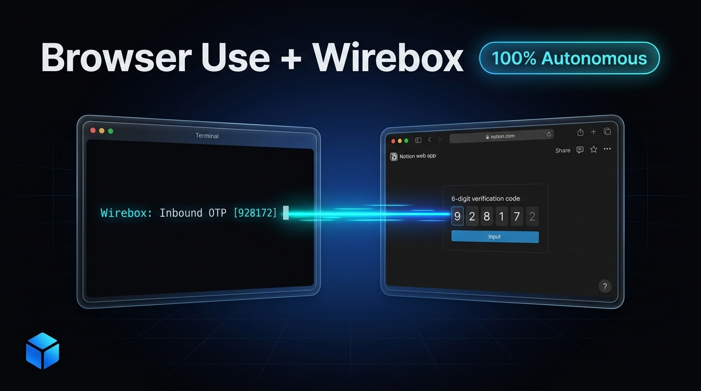

<p align="center">
  
</p>

<h1 align="center">Wirebox Examples & Cookbooks</h1>

<p align="center">
  <b>Official examples, blueprints, and starter recipes for building autonomous AI agents with sovereign communication layers.</b>
  <br />
  <a href="https://wirebox.sh">Website</a> •
  <a href="https://docs.wirebox.sh">Documentation</a> •
  <a href="https://x.com/wirebox_sh">X (Twitter)</a>
</p>

<p align="center">
  <a href="https://github.com/wirebox-sh/wirebox-examples/stargazers"></a>
  <a href="https://github.com/wirebox-sh/wirebox-examples/blob/main/LICENSE"></a>
</p>

---

## ⚡️ Featured Examples

| Directory | Framework / Stack | Focus | One-Click Run |
| :--- | :--- | :--- | :--- |
| **[`/browser-use`](./browser-use)** | [Browser Use](https://browser-use.com) + Chromium | **Autonomous web signup (Notion, Firecrawl) & OTP code verification** | `cd browser-use && uv run wirebox-browser-use` |
| **`/claude-code`** *(Coming soon)* | Anthropic Claude Code | Sovereign email inbox reading & verification for terminal coding agents | `Coming soon` |
| **`/langchain`** *(Coming soon)* | LangChain / LangGraph | Inbound/outbound email toolkits for agentic workflows | `Coming soon` |
| **`/crewai`** *(Coming soon)* | CrewAI | Multi-agent autonomous operations with real-world telecom identities | `Coming soon` |

---

## 🚀 Quickstart: Browser Use Autonomous Agent

The [`browser-use`](./browser-use) example demonstrates an autonomous browser agent that registers for real-world web services (e.g. Notion) by reading its own Wirebox email inbox to bypass 6-digit OTP verification walls.

### 1. Prerequisites
Ensure you have [`uv`](https://docs.astral.sh/uv/) installed (recommended for instant Python execution):
```bash
curl -LsSf https://astral.sh/uv/install.sh | sh
```

### 2. Clone & Run
```bash
git clone https://github.com/wirebox-sh/wirebox-examples.git
cd wirebox-examples/browser-use

# Copy and configure environment variables
cp .env.example .env

# Run autonomous agent with live Chromium window
uv run wirebox-browser-use "Go to notion.com/login, sign in with my email, wait for the verification code, and log in"
```

*(Note: If `WIREBOX_API_KEY` is not provided in `.env`, the CLI will automatically provision a new sovereign mailbox for you on the fly!)*

---

## 💡 What is Wirebox?

Autonomous agents can write complex code, scrape web pages, and call APIs. But the moment they hit real-world communication walls—**email verification codes, OTPs, SMS, or phone confirmation**—they halt and require human intervention.

**[Wirebox](https://wirebox.sh)** is the sovereign identity, communication, and context execution layer for AI agents:
- 📬 **Sovereign Email Inboxes**: Provision real `@wireboxmail.com` addresses with instant inbound webhooks and REST polling.
- ⚡️ **Zero Human in the Loop**: Equip your agents with tools like `wait_for_email()` to parse verification links and 6-digit OTPs in seconds.
- 🔒 **Ephemeral or Persistent**: Spin up disposable mailboxes for one-off signups or persistent identities for production agents.

---

## 🤝 Community & Support

- 🌐 **Platform**: [https://wirebox.sh](https://wirebox.sh)
- 📖 **Docs & API Reference**: [https://docs.wirebox.sh](https://docs.wirebox.sh)
- 🐦 **Twitter/X**: [@wirebox_sh](https://x.com/wirebox_sh)

---

## 📄 License

MIT © [Wirebox](https://wirebox.sh)
